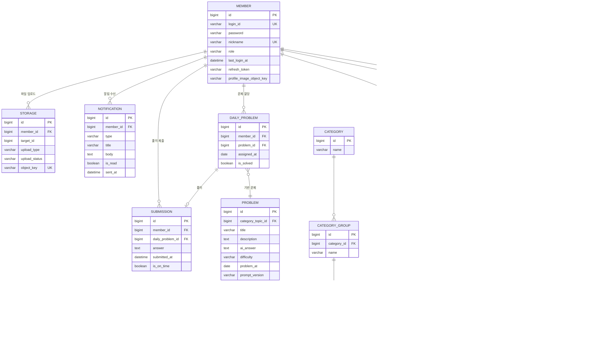

# HaruHana (하루하나) 🌱

> 금방 포기하는 사람들을 위한 꾸준함을 기르는 하루 1문제 풀이 서비스

## 🎯 프로젝트 소개

HaruHana는 부담 없이 가볍게, 경쟁과 비교 없이 오로지 나 자신과의 싸움에 집중하여 꾸준함을 기를 수 있는 일일 학습 서비스입니다.

- **매일 1문제 제공**: AI가 생성한 개인 맞춤형 문제를 매일 자정(00:00)에 제공
- **스트릭 시스템**: 연속 성공 일수 추적으로 꾸준한 학습 동기 부여
- **개인화된 학습**: 난이도와 카테고리를 선택하여 자신에게 맞는 학습 경로 구성
- **AI 기반 문제 생성**: Spring AI + OpenAI를 활용한 다양한 주제의 문제 자동 생성

## 💡 핵심 철학

- 하루 딱 **1문제**
- 가볍게, 부담 없이
- 경쟁 ❌, 비교 ❌
- 꾸준함(스트릭) ✅

## 🚀 주요 기능

### 1. 회원 관리 및 인증
- JWT 기반 인증 시스템
- 회원가입 시 GUEST 권한 부여, 오늘의 문제 설정 완료 시 MEMBER 권한으로 자동 승급
- 로그인 ID 및 닉네임 중복 체크

### 2. 오늘의 문제 설정
- 난이도 선택: EASY, MEDIUM, HARD
- 카테고리 선택: 대분류 → 중분류 → 소분류(토픽) 구조
- 설정 변경은 다음날 자정(00:00)부터 적용
- 첫 설정 완료 시 즉시 문제 제공

### 3. 문제 풀이 시스템
- AI 기반 문제 자동 생성 (생성 실패 시 백업 문제 제공)
- 동일 날짜 + 난이도 + 카테고리 조합당 1개의 문제 생성
- 답변 제출 시 AI 예시 답변 제공
- 당일 내 답변 수정 가능

### 4. 스트릭 시스템
- 연속 문제 풀이 일수 추적
- 현재 스트릭 및 최대 스트릭 기록
- 문제 미풀이 시 스트릭 초기화

### 5. 알림 시스템
- FCM 기반 푸시 알림
- 문제 풀이 독려 알림
- 스트릭 유지 실패 임박 알림
- 새로운 문제 생성 알림

### 6. 내 기록 조회
- 풀이 기록 목록 조회 (날짜, 문제, 제출 여부, 스트릭 반영 여부)
- 풀이 상세 조회 (문제 설명, 회원 답변, AI 예시 답변)
- 스트릭 현황 조회

## 📐 도메인 모델

## 🛠 기술 스택

### Backend
- **Language**: Java 21
- **Framework**: Spring Boot 3.5.7
- **Security**: Spring Security + JWT
- **Database**: MySQL 8.0
- **ORM**: Spring Data JPA
- **AI**: Spring AI + OpenAI API

### Infrastructure
- **Container**: Docker, Docker Compose
- **Reverse Proxy**: Nginx
- **Cloud Storage**: AWS S3
- **Deployment**: AWS EC2

### Monitoring & Testing
- **Monitoring**: Prometheus + Grafana
- **Performance Testing**: k6 + InfluxDB
- **Error Tracking**: Sentry
- **API Documentation**: Swagger (SpringDoc OpenAPI)

## 📞 문의

프로젝트 관련 문의사항이 있으시면 이슈를 생성해주세요.

---

**Made with ❤️ for consistent learners**
