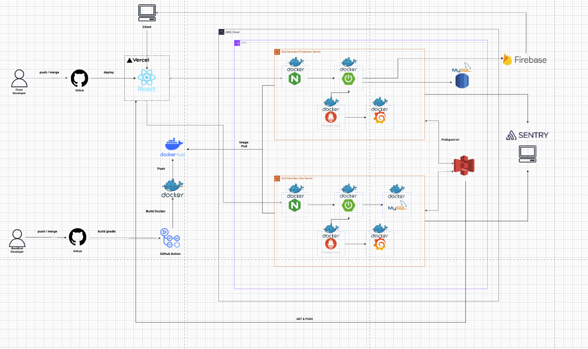

# 시스템 아키텍처

## 전체 아키텍처


---

## CI/CD 파이프라인

### 프론트엔드
```
Frontend Developer
  → push/merge to GitHub
  → Vercel 자동 배포
  → React 앱 서빙
```

### 백엔드
```
Backend Developer
  → push/merge to GitHub
  → GitHub Actions 트리거
    - build gradle (테스트 & 빌드)
    - Docker 이미지 빌드
    - Docker Hub push
  → EC2에서 Image Pull & 컨테이너 재시작
```

---

## 환경별 인프라

| 항목 | Production | Dev |
|------|-----------|-----|
| 서버 | EC2 (Production) | EC2 (Dev) |
| 리버스 프록시 | Nginx (Docker) | Nginx (Docker) |
| 애플리케이션 | Spring Boot (Docker) | Spring Boot (Docker) |
| 데이터베이스 | AWS RDS (MySQL 8.0) | MySQL (Docker) |
| 모니터링 | Prometheus + Grafana | Prometheus + Grafana |
| Swagger | 비활성화 | 활성화 |

---

## 주요 외부 서비스

| 서비스 | 용도 |
|--------|------|
| AWS S3 | 프로필 이미지 저장 (Presigned URL 방식) |
| Firebase FCM | 푸시 알림 발송 |
| Google Gemini | AI 문제 생성 |
| Sentry | 에러 트래킹 및 알림 |
| Slack | 서버 에러 알림 |
